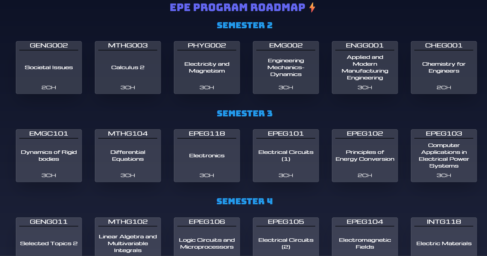

# EPMG Program Roadmap  

## About the Project  
This project is a React-based application designed to showcase the roadmap for the EPMG program.  
The main purpose of this project is to learn and practice React concepts, including JSX, component structure, and state management, while building a visually appealing and functional roadmap.  

## ✨ Features  
- Interactive roadmap for the EPE program  
- Modular React components for better code organization  
- Integration of CSS for styling  
- Semantic HTML for accessibility and structure  

## 🛠️ Built With  
- React  
- Vite  

## 🖼️ Screenshots  
  

## 👷‍♂️ Author  
- Name: Ali Haitham  
- LinkedIn: [Ali Haitham](https://www.linkedin.com/in/ali-haitham-a23901232)
